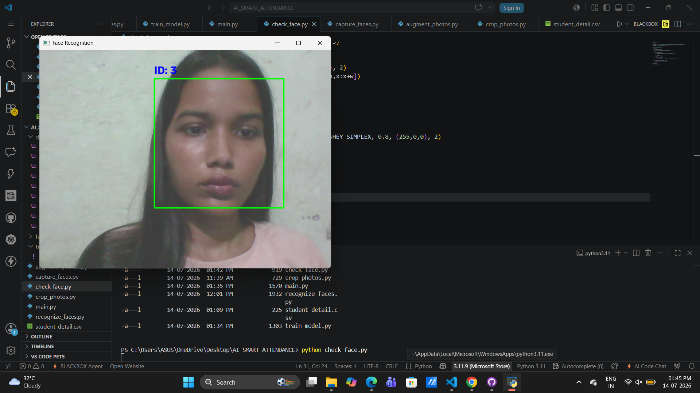

# AI Smart Attendance System 🚀

A Face Recognition based Smart Attendance System built using Python, OpenCV, and LBPH algorithm. This system automatically marks attendance using face recognition and stores it in a CSV file.

## 📌 Features
- 🔍 Real-time face detection using Haar Cascade
- 👤 Face recognition using LBPH algorithm  
- 📝 Automatic attendance marking in CSV/Excel
- 📸 Dataset training for new students
- 📊 Screenshots of training process
- 🖥️ Simple GUI for easy use
- 🔄 Data augmentation for better accuracy

## 🛠️ Tech Stack
- **Language**: Python 3.x
- **Libraries**: OpenCV, NumPy, Pandas, PIL
- **Algorithm**: LBPH Face Recognizer
- **Database**: CSV/Excel

## 🚀 How to Run
1. Clone the repository
```bash```
git clone https://github.com/suhani-its/AI_SMART_ATTENDANCE-SYSTEM.git
cd AI_SMART_ATTENDANCE-SYSTEM
2. Install requirements
   ```bash```
   pip install opencv-contrib-python pillow numpy pandas
3. Capture faces for dataset
    ```bash```
   python capture_faces.py
4. Train the model
    ```bash```
   python train_model.py
5. Run attendance system
    ```bash```
   python check_face.py
   
  ## 📸 Screenshots
### Training Process
Training ke saare steps niche dikhaye gaye hain. System dataset se faces padhkar LBPH recognizer ko train karta hai aur `trainer/trainer.yml` file generate hoti hai.

**1. Dataset Capture**


**2. Open Camera**


**3. Face Recognition**


**4. Student ID and Name**

📁 Project Structure
AI_SMART_ATTENDANCE-SYSTEM
├── dataset/              # Captured face images
├── trainer/              # Trained model file trainer.yml
├── attendance/           # Attendance CSV files
├── screenshots/          # Project screenshots
├── check_face.py         # Main recognition file
├── capture_dataset.py    # For capturing new faces
└── train.py              # For training the model
🚀 Future Scope
Cloud database integration
Email/SMS notification to parents
Web dashboard for attendance
Mobile app support

